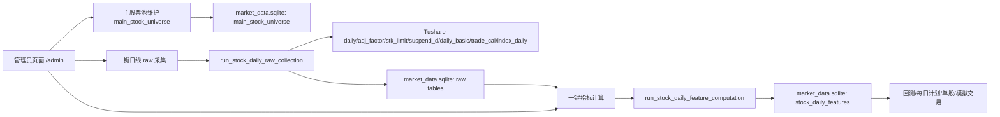
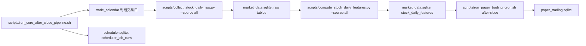
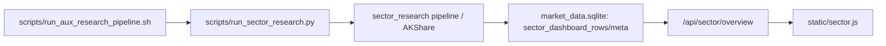
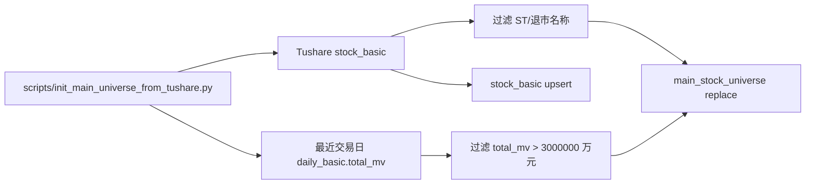

# T_0_system Project Map

生成时间：2026-05-23
来源：腾讯云 `/home/ubuntu/T_0_system` 当前工作区结构盘点
状态：SQLite 主数据链路收口中；日线 raw 采集与指标计算已分离；`source=all` 已改为主股票池范围
目的：给后续 SQLite-only 清理、模块迁移、定时任务维护和管理员功能开发提供系统认知。本文档描述当前真实边界，不等同于删除计划。

## 1. 当前协作约束

- 代码开发以腾讯云 `/home/ubuntu/T_0_system` 为准，不同步到 Windows 本地。
- 除非用户明确要求，不执行 `git add`、`git commit`、`git push`。
- 默认遵循 `AGENTS.md` 与 `.codex/skills/china-quant-backtest/SKILL.md`。
- 修改代码前先分析模块和依赖；不默认大规模重构；不修改无关模块。
- 当前主方向是 SQLite 主线迁移：主股票池、日线 raw、指标、系统运行数据、模块读取都逐步统一到 SQLite。
- 涉及回测、策略、数据库结构、交易成本、复权、成交约束时，先说明影响范围和风险。
- 量化逻辑必须避免未来函数、lookahead bias、train/test 泄漏、survivorship bias；回测必须严格按时间顺序执行。

## 2. 当前系统目标架构

系统正在从 `data_bundle`、处理后 CSV、旧模板库、研究输出目录混合读取，迁移为 SQLite-first 主数据链路。

目标状态：

- 主股票范围由 `data_store/market_data.sqlite.main_stock_universe` 控制。
- 管理员后台和每日核心调度默认只处理主股票池活跃股票。
- `source=all` 不再代表全市场，等价于 `main_universe`，只代表主股票池活跃集合。
- 日线原始输入写入 SQLite raw 表，再由指标计算任务从 raw 表生成 `stock_daily_features`。
- 回测、每日选股、单股回测、模拟账户、板块看板等模块优先读 SQLite 主库。
- 旧 CSV、旧 YAML、旧模板特征表作为迁移期兼容和对照，不再作为主链路设计依据。

## 3. 系统一句话

这是一个 A 股 T 日信号摆动研究、回测、每日计划和多账户模拟交易系统。当前主线是用 Tushare、AKShare 和 SQLite 构建股票日线 raw 数据、前复权指标、主股票池、板块看板和模拟交易账本，并通过 FastAPI 静态前端提供管理员、回测、选股、账户和研究入口。

## 4. 技术栈与运行形态

- 后端：FastAPI + Uvicorn，入口为 `overnight_bt.app:app`。
- 数据处理：pandas、openpyxl、pyyaml。
- 外部数据：Tushare、AKShare、httpx。
- 前端：`static/` 下静态 HTML/CSS/JS，调用 FastAPI JSON API。
- 主运行库：SQLite，位于 `data_store/`。
- 运行日志：`logs/` 与 `runtime_logs/`。
- 生产虚拟环境：`source /home/ubuntu/TencentCloud/myenv/bin/activate`。
- 服务端口：`8083`，管理员页面 `/admin`。

## 5. 顶层目录地图

| 路径 | 当前职责 | 迁移状态 |
| --- | --- | --- |
| `AGENTS.md` | 当前仓库协作约束 | 必读 |
| `README.md` | 系统准备、数据准备、启动、入口和复现说明 | 已同步 SQLite 主线，但仍有旧研究命令 |
| `PROJECT_MAP.md` | 当前项目结构和迁移地图 | 本文档 |
| `requirements.txt` | Python 依赖 | 保持现状 |
| `overnight_bt/` | 核心 Python 包 | SQLite 主线迁移重点 |
| `scripts/` | CLI 数据准备、迁移、调度、研究脚本 | 已有核心 SQLite 调度；仍保留旧 CSV 研究脚本 |
| `static/` | 前端页面与交互脚本 | 管理员、登录、回测、每日、模拟、单股、股票池、板块页面 |
| `docs/` | 中文系统文档、数据字典、指标和研究结果 | 新增/修改数据结构时同步更新 |
| `tests/` | 单元测试与接口集成测试 | 已覆盖认证、主股票池、主库、调度、SQLite-only、板块等 |
| `data_store/` | SQLite 运行时数据库 | 当前主数据和运行状态目录 |
| `configs/paper_accounts/` | 旧 YAML 模拟账户模板 | 兼容导入来源，不是主账本 |
| `logs/` | 调度、采集、模拟交易、服务日志 | 当前仍保留 |
| `runtime_logs/` | 运行日志/服务输出 | 当前仍保留 |
| `sector_research/` | 独立板块研究子系统和输出 | 看板结果可写入 SQLite 主库 |
| `paper_trading/` | 历史模拟交易目录 | 旧产物兼容/对照，主账本在 SQLite |

## 6. SQLite 数据库地图

### 6.1 `data_store/market_data.sqlite`

这是当前目标主数据仓库。最近盘点时表行数如下：`main_stock_universe=733`、`stock_basic=5522`、`stock_daily_raw=2420947`、`stock_adj_factor=2426714`、`stock_stk_limit=2424659`、`stock_suspend_d=5624`、`stock_daily_basic=5504`、`trade_calendar=1721`、`market_context=1721`、`stock_daily_features=959154`、`sector_dashboard_rows=0`、`sector_dashboard_meta=0`。

| 表 | 职责 | 主要写入者 | 主要读取者 |
| --- | --- | --- | --- |
| `main_stock_universe` | 当前系统主股票范围 | `main_universe.py`、管理员 API、`scripts/init_main_universe_from_tushare.py`、软重置脚本 | 核心采集、指标计算、管理员看板、模板校验 |
| `stock_basic` | A 股基础信息缓存 | Tushare 初始化、raw 采集、主股票池初始化 | 名称解析、模板保存、指标快照元信息 |
| `stock_daily_raw` | Tushare `daily` 原始日线 | `run_stock_daily_raw_collection`、`scripts/collect_stock_daily_raw.py` | `run_stock_daily_feature_computation` |
| `stock_adj_factor` | Tushare `adj_factor` 复权因子 | raw 采集任务 | 指标计算 |
| `stock_stk_limit` | 涨跌停价格 | raw 采集任务 | 指标计算、交易约束字段 |
| `stock_suspend_d` | 停复牌信息 | raw 采集任务 | 指标计算、可买可卖字段 |
| `stock_daily_basic` | 日度基础面快照，如总市值、换手、估值 | raw 采集任务、主股票池初始化参考 | 指标快照、主股票池筛选 |
| `trade_calendar` | 交易日历 | raw 采集任务、交易日判断 | 指标计算、调度交易日判断 |
| `market_context` | 指数环境字段 | raw 采集任务 | 指标计算、策略字段 |
| `stock_daily_features` | 股票日线指标、前复权价格、原始成交价、交易约束、大盘字段 | `run_stock_daily_feature_computation`、迁移脚本、兼容旧更新链路 | 回测、信号质量、每日计划、单股、模拟交易 |
| `sector_dashboard_rows` | 板块看板数据集行，以 JSON 存储 dataset | `sector_dashboard_store.py`、`sector_research/pipeline.py` | `/api/sector/overview` |
| `sector_dashboard_meta` | 板块看板摘要元信息 | `sector_dashboard_store.py` | `/sector` 页面 |

主股票池当前已按“非 ST、非退市、市值大于 300 亿”初始化：快照交易日 `20260522`，候选 `5522` 只，活跃写入 `733` 只，来源标记 `tushare_non_st_total_mv_gt_300y`。市值阈值使用 Tushare `daily_basic.total_mv` 的万元单位，300 亿等于 `3,000,000` 万元。

### 6.2 `data_store/stock_pool_templates.sqlite`

这是用户、认证、股票池模板和迁移期兼容库，不再是行情主库。服务运行时可能锁库，统计时不要强行抢锁。

| 表 | 职责 | 说明 |
| --- | --- | --- |
| `users` | 用户基础信息 | 同时被 `auth.py` 复用，已扩展 role/is_active/password 字段 |
| `auth_sessions` | 登录会话 | 静态页面和 API 鉴权依赖 |
| `stock_pool_templates` | 用户股票池模板头表 | 用于模板管理和兼容入口 |
| `stock_pool_template_stocks` | 模板成分股 | 用户自选池/模板池，不应驱动默认主采集 |
| `stock_basic` | 股票基础信息缓存 | 名称解析、模板保存、初始化测试使用 |
| `stock_daily_features` | 旧共享行情特征表 | 迁移期兼容，不再作为主读取目标 |
| `stock_pool_update_jobs` | 股票池/行情更新任务头表 | 管理员和 CLI 任务记录 |
| `stock_pool_update_job_items` | 单股票任务明细 | 任务诊断和日志 |

### 6.3 `data_store/paper_trading.sqlite`

这是模拟交易主运行库。

| 表/视图 | 职责 |
| --- | --- |
| `paper_account_templates` | 账户模板，按用户和账户标识管理 |
| `paper_config_snapshot` | 运行时配置快照 |
| `paper_pending_orders` | 待执行订单 |
| `paper_trades` | 成交流水 |
| `paper_holdings` | 当前持仓 |
| `paper_assets` | 每日资产 |
| `paper_logs` | 运行日志 |
| `paper_account_ledgers` | 账本行数聚合视图 |

### 6.4 `data_store/scheduler.sqlite`

这是调度运行状态库。

| 表 | 职责 |
| --- | --- |
| `scheduler_jobs` | 任务名、更新时间、最近 run_id |
| `scheduler_job_runs` | 每次运行的状态、目标日期、失败阶段、日志路径、重跑来源 |

## 7. 当前主数据流

### 7.1 管理员触发链路

管理员界面是主链路的人工触发入口。四个按钮分别覆盖：当天日线采集、当天指标计算、区间日线采集、区间指标计算。默认股票范围来自主股票池；`source=all` 只是兼容参数名，不再扩大到全市场。

### 7.2 每日核心定时链路

该链路默认 `T0_SQLITE_ONLY=1`。`STOCK_POOL_SOURCE` 默认是 `all`，但当前 `all` 的真实含义是主股票池活跃股票。

### 7.3 辅助研究/板块看板链路

板块看板已具备 SQLite 读写路径。CSV 读取路径仍保留为显式兼容模式，在 SQLite-only 下应被阻断。

### 7.4 主股票池初始化链路

## 8. 后端模块地图

### 8.1 API、鉴权和模型

| 文件 | 当前职责 | 迁移注意点 |
| --- | --- | --- |
| `overnight_bt/app.py` | FastAPI 路由、页面入口、认证保护、管理员 API、导出接口 | 新路由集中在此，改动前看对应模型和前端 payload |
| `overnight_bt/models.py` | Pydantic 请求/响应模型与运行时 dataclass | `StockPoolRefreshRequest.source` 保留 `all`，但说明应理解为主股票池 |
| `overnight_bt/auth.py` | 用户注册、登录、session、管理员权限 | 使用 `stock_pool_templates.sqlite` 的 `users` 和 `auth_sessions` |
| `overnight_bt/utils.py` | env、日期、目录、板块推断、数值工具 | 多模块共用，改动需小心 |

### 8.2 SQLite 主线模块

| 文件 | 当前职责 | 主数据库 |
| --- | --- | --- |
| `overnight_bt/main_universe.py` | 主股票池保存、名称解析、代码标准化 | `market_data.sqlite.main_stock_universe`，兼容读取旧 `stock_basic` |
| `overnight_bt/market_data_store.py` | 初始化/写入/读取主库特征表和 raw 表；兼容旧特征表 fallback | `market_data.sqlite` |
| `overnight_bt/stock_pool_feature_store.py` | 股票范围解析、Tushare raw 采集、SQLite raw 入库、指标计算、任务日志、迁移期兼容 | 主写 `market_data.sqlite`；默认 `all/main_universe` 只读主股票池 |
| `overnight_bt/sqlite_only_guard.py` | `T0_SQLITE_ONLY` 下阻断旧 CSV/YAML/fallback | 所有 SQLite-only 迁移模块 |
| `overnight_bt/sqlite_runtime_reset.py` | 软重置运行数据并种入单股票样本 | 四个 SQLite 运行库 |
| `overnight_bt/scheduler.py` | 调度任务和 run 状态记录 | `scheduler.sqlite` |
| `overnight_bt/trade_calendar.py` | 判断 A 股交易日，优先 Tushare，失败时读 SQLite 数据 | Tushare + `market_data.sqlite` |

### 8.3 回测、信号、每日计划和单股

| 文件 | 当前职责 | SQLite-only 状态 |
| --- | --- | --- |
| `overnight_bt/backtest.py` | 组合回测、资金/仓位/手续费/滑点/严格成交、导出 | 默认股票池/主库读取；CSV 模式显式启用，SQLite-only 下阻断 |
| `overnight_bt/signal_quality.py` | 信号质量回测，评估信号后续收益 | 默认股票池/主库读取；旧 processed CSV 仍是兼容路径 |
| `overnight_bt/daily_plan.py` | 每日收盘选股、持仓卖出提醒、次日计划 | 默认股票池/主库读取 |
| `overnight_bt/single_stock.py` | 单股表格回测 | 默认读主库；CSV/Excel 旧路径显式兼容 |
| `overnight_bt/expressions.py` | 买入/卖出条件和评分表达式 | 字段白名单影响所有入口，属于高风险模块 |

### 8.4 模拟交易

| 文件 | 当前职责 | SQLite-only 状态 |
| --- | --- | --- |
| `overnight_bt/paper_trading.py` | 账户模板、待执行订单、成交、持仓、资产、日志、旧 YAML 导入 | 主账本已在 `paper_trading.sqlite`；旧 YAML 仅兼容导入 |
| `scripts/run_paper_trading.py` | 单账户或全账户模拟交易 CLI | 调用 `paper_trading.py` |
| `scripts/run_paper_trading_cron.sh` | 盘后/开盘/收盘估值定时包装 | 当前核心链 check-only 已通过 |

### 8.5 板块研究和看板

| 文件 | 当前职责 | SQLite-only 状态 |
| --- | --- | --- |
| `overnight_bt/sector_dashboard.py` | 组装板块看板 payload，兼容 CSV/JSON/SQLite | 默认应走 SQLite；CSV 显式兼容 |
| `overnight_bt/sector_dashboard_store.py` | 板块看板 SQLite 存取 | `market_data.sqlite` |
| `sector_research/pipeline.py` | AKShare 板块研究流水线 | 可写 SQLite 看板表 |
| `sector_research/providers.py` | 数据 provider | 仍依赖外部行情源和研究输出 |
| `overnight_bt/sector_features.py` | 板块特征校验/展示值 | 研究链路使用 |

### 8.6 仍偏旧 CSV 的数据处理/研究模块

| 文件 | 当前职责 | 风险 |
| --- | --- | --- |
| `overnight_bt/processing.py` | 从 Tushare 原始表构建单股票 processed frame | 指标计算仍复用其纯函数；旧 per-stock CSV 生成不应再作为主链路 |
| `scripts/build_processed_data.py` | 旧 per-stock qfq CSV 构建脚本 | 旧链路，后续应废弃或改为 SQLite 写入 |
| `overnight_bt/tushare_data.py` | 旧 Tushare bundle 同步和 universe snapshot | 旧数据包链路 |
| `overnight_bt/industry_strength.py` | 基于 processed CSV 聚合行业强度 | 旧 CSV 增强链路 |
| `overnight_bt/theme_universe.py`、`universe_filters.py` | 主题/可交易股票池研究 | 删除前需确认无主链路依赖 |
| `overnight_bt/rotation_features.py` | 轮动增强占位/历史模块 | 当前主链路不应依赖 |

## 9. 前端页面与 API 入口

| 页面 | 文件 | 关键 API | 当前职责 |
| --- | --- | --- | --- |
| 登录 | `static/login.html`、`static/auth.js` | `/api/auth/login`、`/api/auth/me` | 登录态和跳转 |
| 注册 | `static/register.html` | `/api/auth/register` | 用户注册 |
| 组合回测 | `static/index.html`、`static/app.js` | `/api/run-backtest`、导出接口 | 组合策略回测 |
| 单股回测 | `static/single.html`、`static/single.js` | `/api/run-single-stock` | 单股票策略回测 |
| 每日计划 | `static/daily.html`、`static/daily.js` | `/api/daily-plan` | 每日收盘选股/卖出提醒 |
| 多账户模拟 | `static/paper.html`、`static/paper.js` | `/api/paper/*` | 模拟交易运行、账本查看 |
| 模拟账户模板 | `static/paper_templates.html`、`static/paper_templates.js` | `/api/paper/templates` | 账户模板维护 |
| 股票池模板 | `static/stock_pools.html`、`static/stock_pools.js` | `/api/stock-pools/*` | 用户模板维护；不负责默认主采集 |
| 系统管理员 | `static/admin.html`、`static/admin.js` | `/api/admin/*` | 主股票池、日线 raw 采集、指标计算、调度记录 |
| 用户管理 | `static/users.html`、`static/users.js` | `/api/users` | 管理员管理用户 |
| 板块看板 | `static/sector.html`、`static/sector.js` | `/api/sector/overview` | 板块研究可视化 |

## 10. 脚本地图

### 10.1 SQLite 主线脚本

| 脚本 | 当前职责 | 备注 |
| --- | --- | --- |
| `scripts/init_main_universe_from_tushare.py` | 按非 ST 且市值大于 300 亿初始化主股票池 | 当前主股票池 733 只来自此脚本 |
| `scripts/collect_stock_daily_raw.py` | 将主股票池或指定来源的 Tushare raw 输入采集到 SQLite raw 表 | 默认 `--source all`，即主股票池 |
| `scripts/compute_stock_daily_features.py` | 从 SQLite raw 表计算并写入 `stock_daily_features` | 默认 `--source all`，即主股票池 |
| `scripts/run_core_after_close_pipeline.sh` | 每日核心链：交易日判断、raw 采集、指标计算、盘后模拟 | 设置 `T0_SQLITE_ONLY=1` |
| `scripts/run_aux_research_pipeline.sh` | 辅助研究/板块链路包装 | 不属于核心日线/模拟闭环 |
| `scripts/migrate_legacy_stock_pool_to_market_data.py` | 把旧模板库特征表迁到主数据表，并初始化主股票池 | 迁移工具 |
| `scripts/soft_reset_sqlite_runtime.py` | 备份并软重置 SQLite 运行数据 | 验证/重初始化工具 |
| `scripts/audit_sqlite_only_read_paths.py` | 审计 SQLite-only 下仍可能读取旧文件的路径 | 收口前应反复运行 |
| `scripts/verify_delivery.py` | 文档和交付基础检查 | 交付前辅助检查 |

### 10.2 兼容/旧链路脚本

| 脚本 | 当前职责 | 后续处理建议 |
| --- | --- | --- |
| `scripts/init_stock_pool_feature_store.py` | 旧共享日线与指标库初始化 | 保留兼容，默认主线已被 raw/compute 两段替代 |
| `scripts/run_stock_pool_template_update.py` | 旧模板股票共享日线与指标更新 | legacy 运维入口，不应作为默认主采集 |
| `scripts/run_after_close_pipeline.sh` | 历史收盘后调度 | 与核心链并存，需确认是否废弃 |
| `scripts/build_processed_data.py` | 旧 per-stock processed CSV 构建 | 后续删除或改造为 SQLite |
| `scripts/sync_tushare_bundle.py` | 旧 Tushare bundle 下载 | 旧数据包链路 |
| `scripts/build_*theme*`、`scripts/build_*sector*`、`scripts/run_*grid*` | 主题、行业、轮动、参数网格研究 | 如果删除相关模块，需要同步清理文档、测试和前端入口 |

## 11. 已迁移和待迁移状态

### 11.1 已进入 SQLite-first 的模块

- 主股票池：`main_stock_universe` 已落在 `market_data.sqlite`。
- 默认股票范围：`source=all/main_universe` 只读主股票池。
- 日线 raw 采集：`stock_daily_raw`、`stock_adj_factor`、`stock_stk_limit`、`stock_suspend_d`、`stock_daily_basic`、`trade_calendar`、`market_context`。
- 指标计算：从 SQLite raw 表生成 `stock_daily_features`。
- 管理员后台：已具备主股票池维护、当天/区间日线采集、当天/区间指标计算、调度记录查看。
- 核心定时链路：`run_core_after_close_pipeline.sh` 已走 raw 采集、指标计算、盘后模拟三段。
- 回测、每日计划、单股、模拟交易：默认读主库/主账本。
- 认证和用户管理：已落 SQLite。
- 板块看板：具备 SQLite 表和 API 读取路径。

### 11.2 仍需迁移或清理的旧链路

- `scripts/build_processed_data.py` 和 `overnight_bt/processing.py` 的旧 per-stock CSV 生成链路。
- `data_bundle`、processed CSV、Excel 文件路径作为显式兼容输入仍在多个模块中存在。
- 主题、行业、轮动增强研究模块仍保留大量 CSV 读写脚本和测试。
- legacy 股票池模板刷新 API 和任务表仍保留，避免旧脚本立刻断裂。
- `configs/paper_accounts/*.yaml` 仍作为模拟账户模板导入来源。

## 12. SQLite-only 审计快照

| 区域 | 文件/入口 | 关注点 |
| --- | --- | --- |
| 回测 | `backtest.py`、`static/app.js` | 默认数据源是否仍可能回落 CSV |
| 信号质量 | `signal_quality.py` | 旧 processed_dir 兼容路径是否被默认触发 |
| 每日计划 | `daily_plan.py` | 股票范围和行情是否只来自主库 |
| 单股 | `single_stock.py` | Excel/CSV 兼容路径是否被显式 opt-in 控制 |
| 模拟交易 | `paper_trading.py` | YAML 只作为模板导入，不作为运行账本 |
| 板块 | `sector_dashboard.py`、`sector_research/pipeline.py` | SQLite 看板与 CSV 输出边界 |
| 旧研究 | `industry_strength.py`、`theme_universe.py`、`universe_filters.py` | 是否从主链路删除或隔离 |
| 脚本 | `scripts/audit_sqlite_only_read_paths.py` | 每次清理前后跑审计 |

## 13. 高风险改动区

| 区域 | 风险 |
| --- | --- |
| `expressions.py` | 买入/卖出条件、评分字段和 offset 读取会直接影响所有回测和模拟结果 |
| `processing.py` / `stock_pool_feature_store.py` | 指标公式、复权、停牌、涨跌停、交易日处理影响所有策略口径 |
| `market_data_store.py` | 表结构、upsert、legacy fallback 影响全系统读取 |
| `paper_trading.py` | 订单生成、成交价、手续费、持仓、资产曲线影响模拟交易账本 |
| `backtest.py` | 严格成交、资金管理、手续费滑点和导出结果影响策略验证 |
| `main_universe.py` | 主股票池范围错误会放大或缩小所有默认采集/计算/回测 |
| `run_core_after_close_pipeline.sh` | 每日调度顺序错误会导致模拟交易使用缺失或过期指标 |
| `trade_calendar.py` | 非交易日判断错误会触发无效采集或跳过有效交易日 |

## 14. 常见改动影响矩阵

| 改动 | 影响模块 | 是否影响 API | 是否影响历史回测 | 是否影响数据库结构 |
| --- | --- | --- | --- | --- |
| 改 `source=all` 解析 | 管理员采集、CLI、核心调度 | 参数不变，语义变 | 新数据范围改变，旧结果不自动重算 | 否 |
| 改主股票池筛选 | 所有默认采集/计算/回测 | 否 | 后续回测 universe 改变 | 否，除非改字段 |
| 改 raw 表结构 | 采集、指标计算、调度 | 可能间接影响任务返回 | 是，指标可变 | 是 |
| 改指标公式 | 回测、每日计划、模拟交易、单股 | 否 | 是，必须重新计算指标 | 否或可能新增字段 |
| 改交易成本 | 回测、信号质量、模拟交易 | 否 | 是 | 否 |
| 删除主题/行业/轮动模块 | 板块页、研究脚本、文档、测试 | 可能影响 `/sector` 或研究 API | 若主策略未引用则不影响核心回测 | 通常否 |
| 改模拟交易账本 | paper API、cron、前端账本 | 可能 | 不影响历史回测，但影响模拟账户历史 | 可能 |

## 15. 下一批 SQLite-only 迁移建议顺序

1. 巩固 `processing.py` 纯指标函数与 `compute_stock_daily_features.py` 的边界，确认旧 per-stock CSV 构建不再被核心任务调用。
2. 审计 `run_after_close_pipeline.sh` 与 `run_core_after_close_pipeline.sh` 的职责，明确只保留一个核心定时入口。
3. 对回测、每日计划、单股、模拟交易跑一次 `T0_SQLITE_ONLY=1` 全链路冒烟，确认不读 CSV。
4. 如果决定删除系统主题、行业、轮动增强模块，先列出涉及文件、API、前端页面、测试、文档，再分批删除。
5. 把仍有价值的研究输出迁入明确命名的 SQLite 表；没有价值的旧 CSV 研究脚本进入删除清单。
6. 删除旧链路前，保留一次数据库备份和最小复现命令。

## 16. 建议阅读顺序

### 16.1 修改管理员/主股票池/采集链路前

1. `overnight_bt/app.py`
2. `overnight_bt/models.py`
3. `overnight_bt/main_universe.py`
4. `overnight_bt/stock_pool_feature_store.py`
5. `overnight_bt/market_data_store.py`
6. `scripts/init_main_universe_from_tushare.py`
7. `scripts/collect_stock_daily_raw.py`
8. `scripts/compute_stock_daily_features.py`
9. `tests/test_main_universe.py`
10. `tests/test_stock_pool_templates.py`
11. `tests/test_api_integration.py`

### 16.2 修改回测/信号/每日计划前

1. `overnight_bt/models.py`
2. `overnight_bt/expressions.py`
3. `overnight_bt/backtest.py`
4. `overnight_bt/signal_quality.py`
5. `overnight_bt/daily_plan.py`
6. `overnight_bt/market_data_store.py`
7. `tests/test_backtest.py`
8. `tests/test_conditions.py`
9. `tests/test_score_expression.py`

### 16.3 修改单股回测前

1. `overnight_bt/single_stock.py`
2. `overnight_bt/market_data_store.py`
3. `static/single.js`
4. `tests/test_single_stock.py`

### 16.4 修改多账户模拟交易前

1. `overnight_bt/paper_trading.py`
2. `scripts/run_paper_trading.py`
3. `scripts/run_paper_trading_cron.sh`
4. `static/paper.js`
5. `tests/test_paper_trading.py`
6. `docs/paper-trading-system.md`

### 16.5 修改板块研究/看板前

1. `overnight_bt/sector_dashboard.py`
2. `overnight_bt/sector_dashboard_store.py`
3. `sector_research/pipeline.py`
4. `static/sector.js`
5. `tests/test_sector_dashboard_sqlite.py`
6. `docs/sector-dashboard-sqlite-data-dictionary.md`

### 16.6 修改调度前

1. `scripts/run_core_after_close_pipeline.sh`
2. `scripts/run_aux_research_pipeline.sh`
3. `scripts/run_paper_trading_cron.sh`
4. `overnight_bt/scheduler.py`
5. `overnight_bt/trade_calendar.py`
6. `tests/test_scheduler.py`
7. `tests/test_sqlite_only_pipeline_scripts.py`
8. `tests/test_trade_calendar.py`

## 17. 当前工作区状态提醒

- 当前远端 worktree 很脏，包含大量既有修改和未跟踪文件；不要回退用户或前序任务改动。
- `PROJECT_MAP.md` 当前是未跟踪文件，更新时仅作为系统认知文档处理。
- `data_store/stock_pool_templates.sqlite` 在服务运行时可能被锁，排查时优先读 API 或停服务后统计，不要强行破坏锁。
- Tushare token 从环境或 `.env` 读取，绝不写入代码、文档或提交记录。

## 18. 最小验证建议

| 场景 | 建议命令 |
| --- | --- |
| 文档/交付基础检查 | `python scripts/verify_delivery.py` |
| 主股票池逻辑 | `env -u PYTEST_ADDOPTS python -m pytest tests/test_main_universe.py -q` |
| raw/指标分离链路 | `env -u PYTEST_ADDOPTS python -m pytest tests/test_stock_pool_templates.py -q` |
| 管理员 API | `env -u PYTEST_ADDOPTS python -m pytest tests/test_api_integration.py::ApiIntegrationTest::test_admin_page_and_stock_data_api -q` |
| SQLite-only 审计 | `env -u PYTEST_ADDOPTS python -m pytest tests/test_sqlite_only_audit.py tests/test_sqlite_only_guard.py -q` |
| 核心调度结构检查 | `scripts/run_core_after_close_pipeline.sh --check-only 20260523` |
| 服务冒烟 | `systemctl is-active t0-system && curl -sS http://127.0.0.1:8083/health` |

## 19. 当前行动原则

- 新功能默认读写 SQLite 主库。
- 默认股票范围只来自主股票池；不要再把 `all` 理解为全市场。
- 日线采集和指标计算保持分离：先 raw，后 feature。
- 能用主库读的模块不要新增 CSV fallback。
- 旧 CSV/YAML/研究脚本只作为显式兼容，不能悄悄进入默认路径。
- 涉及策略结果的改动必须说明口径变化，并用测试或小样本复现验证。