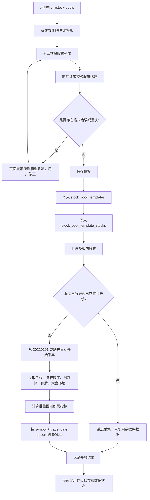
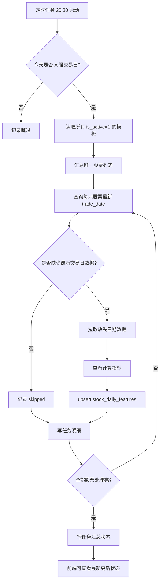
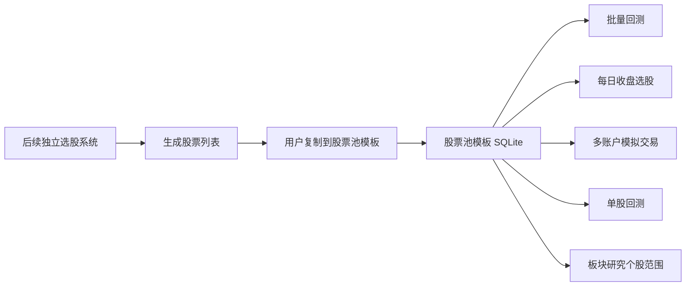

# 股票池模板系统规划设计稿

本文档用于规划一个独立的股票池模板系统。当前第一阶段已经实现“模板 + 手工股票列表 + SQLite 基础表 + 前端管理页面”；第二阶段已经实现共享日线与指标入库、任务日志、任务表和 CLI/API 更新入口；第四阶段已先把批量回测前端和后端接入股票池模板 SQLite。每日收盘选股、多账户模拟交易、单股回测和板块研究仍待后续逐步接入。

## 0. 第一阶段实现状态

截至 2026-05-13，第一阶段已完成并保留以下边界：

- 已实现 SQLite 建库和基础表迁移，数据库路径为 `data_store/stock_pool_templates.sqlite`。

> 当前未接入登录系统，系统固定使用 `admin` 作为模板所属用户。登录系统接入后，前端应从登录态自动带入用户名，不在页面上提供手工输入。所有模板默认参与后续每日更新，第一阶段不提供“不参与更新”选项。校验和保存时，重复股票会自动去重，只保留首次出现的顺序；股票名称会从 SQLite `stock_basic`、Top500 分层文件、当前 Top100 处理后 CSV 和已有股票池快照中尽量回填。
- 已实现模板列表、读取、保存、删除、股票列表校验和基础模板初始化 API。
- 已实现 `/stock-pools` 前端页面，支持新建、复制、载入、保存、删除、校验和初始化基础模板。
- 已实现默认用户 `admin`。
- 已实现基础模板：`L0_最大市值主题股层` 到 `L4_最小市值主题股层`，以及 `当前多账户模拟股票池`。
- 已新增数据说明文档 `docs/stock-pool-template-data-dictionary.md`，并更新 `README.md` 和 `docs/system-documentation.md`。
- 第一阶段不会抓取行情，不会计算指标，不会触发定时任务，也不会改变任何旧模块的 CSV 输入。

## 0.1 第二阶段实现状态

截至 2026-05-14，第二阶段已完成“数据采集与指标入库”的基础闭环：

- 新增 `overnight_bt/stock_pool_feature_store.py`，统一负责股票范围去重、Tushare 行情拉取、指标计算、SQLite upsert、日志输出和任务表记录。
- 新增共享日线入库逻辑，所有用户和模板共用 `stock_daily_features`，主键为 `symbol + trade_date`，不会按模板重复存储行情。
- 支持四类更新来源：`active_templates`、`template`、`symbols`、`all`。`all` 用于系统初始化全市场股票；其余用于模板或手工股票的补数和刷新。
- 新增 CLI：`scripts/init_stock_pool_feature_store.py`、`scripts/run_stock_pool_template_update.py`、`scripts/run_stock_pool_template_update.sh`。
- 新增 API：`POST /api/stock-pools/template/refresh`、`GET /api/stock-pools/jobs`、`GET /api/stock-pools/jobs/{job_id}`。
- 数据刷新和任务查看为 admin-only 能力。当前未接入登录系统时，后端以 `username=admin` 作为过渡校验；后续接入登录后应改为从 session/token 获取用户。普通用户可以管理自己的模板，但不能触发 Tushare 刷新或查看更新任务。
- 每次任务都会写入 `stock_pool_update_jobs` 和 `stock_pool_update_job_items`，并在 `logs/stock_pool_template_update/` 输出 `.log`、`_items.csv`、`_summary.json`；新任务会把这些输出路径同步记录到任务表，旧任务若无路径则页面显示“历史任务未记录”。
- 数据更新已支持 `--batch-size/--batch-index/--offset` 分批、`--resume-after-symbol` 断点续跑、`--retry-attempts/--retry-sleep-seconds` 单股失败重试，以及默认只补库内缺失数据。
- 单测已用假数据源验证“模板股票 -> 日线/复权/交易日历/大盘环境 -> 指标 -> SQLite -> 任务日志”的完整链路，并覆盖分批、只补缺失、断点续跑和重试行为。
- 保存模板本身仍只保存模板和股票关系；行情采集通过手动刷新、初始化脚本或后续定时任务触发，避免前端保存请求被长时间阻塞。

本阶段新增或修改的核心文件：

| 文件 | 说明 |
| --- | --- |
| `overnight_bt/stock_pool_templates.py` | SQLite 初始化、模板 CRUD、股票列表解析、基础模板初始化 |
| `overnight_bt/app.py` | `/stock-pools` 页面和 `/api/stock-pools/*` API |
| `overnight_bt/models.py` | 股票池模板请求与响应模型 |
| `static/stock_pools.html` | 股票池模板管理页面 |
| `static/stock_pools.js` | 前端交互逻辑 |
| `static/style.css` | 股票池页面紧凑工作台样式 |
| `tests/test_stock_pool_templates.py` | SQLite 和模板逻辑单测 |
| `tests/test_api_integration.py` | 页面和 API 集成测试 |
| `tests/test_paper_frontend_formatting.py` | 前端 JS 行为测试 |
| `docs/stock-pool-template-data-dictionary.md` | 第一阶段数据说明 |

## 1. 目标与边界

### 1.1 系统目标

股票池模板系统用于让用户手工维护一组股票列表，并把这些股票的日线数据和批量回测需要的指标统一存入 SQLite。后续其他模块可以从股票池模板读取股票范围和行情指标，而不是各自维护 CSV 目录。

核心目标：

- 提供类似账户模板管理的前端页面，支持新建、复制、保存、删除股票池模板。
- 用户手工输入股票列表，系统不在本模块内做自动筛选。
- 保存模板后，系统为新增股票一次性采集 `20220101` 至最新交易日的数据。
- 同一只股票在多个模板中复用同一份数据库日线数据，不重复采集、不重复存储。
- 每天晚上定时更新所有模板涉及的股票日线数据，并重新计算批量回测需要的指标。
- 默认用户为 `admin`；后续接入账户名和密码登录后，模板按实际用户隔离。

### 1.2 明确不做的事情

股票池模板系统不承担“自动选股”职责。下面能力后续应作为独立的“选股系统”开发，生成股票列表后由用户复制到股票池模板系统：

- 按主题暴露、板块、行业、市值 TopN 自动生成股票。
- 按 L0-L4、市值区间、上市天数、是否 ST、是否北交所等条件自动筛选。
- 按指数成分、混合规则、模型评分生成股票。
- 自动决定是否增强行业强度、板块字段或轮动字段。

## 2. 与现有系统的关系

当前系统仍然使用 CSV 目录作为输入：

| 模块 | 当前输入 | 本阶段是否改动 |
| --- | --- | --- |
| 每日收盘选股 | `processed_dir`，目录内每只股票一个 CSV | 不改 |
| 多账户模拟交易 | 账户模板 YAML 中的 `处理后数据目录` | 不改 |
| 批量回测 | 前端选择股票池模板；后端支持 `data_source=stock_pool` 读取 SQLite，并保留 `data_source=csv` 兼容 | 已接入 |
| 单股回测 | 股票代码 + CSV 数据目录 | 不改 |
| 板块研究 | 板块研究 CSV、个股暴露 CSV、增强后的股票 CSV | 不改 |

本阶段只新增股票池模板系统、SQLite 数据结构和数据更新流程。后续再逐步把这些模块的输入从 CSV 切换为股票池模板。

推荐后续接入顺序：

1. 批量回测先支持选择股票池模板读取 SQLite。
2. 每日收盘选股支持选择股票池模板。
3. 多账户模拟交易账户模板增加 `股票池模板` 字段，并保留旧的 `处理后数据目录` 兼容。
4. 单股回测支持从 SQLite 查询单股历史。
5. 板块研究的个股暴露或增强输出再考虑引用股票池模板。

## 3. 前端功能设计

页面入口建议为 `/stock-pools`，命名为“股票池模板管理”。

页面能力：

- 选择模板：从当前用户的股票池模板中选择。
- 载入模板：把模板信息和股票列表载入编辑区。
- 新建模板：初始化空白模板。
- 复制模板：复制当前模板为新草稿，自动生成新模板名，股票列表保持一致。
- 保存模板：保存当前模板；新股票会进入数据采集队列。
- 删除模板：只删除模板和模板股票关系，不删除 SQLite 中已有股票日线数据。
- 股票列表输入框：用户手工粘贴股票代码，支持一行一个、逗号分隔、空格分隔。
- 股票校验预览：保存前显示有效股票、重复股票、格式错误股票。
- 更新状态：显示模板内股票的最新数据日期。
- admin 数据运维区：仅 admin 可见，支持手动刷新当前模板数据、查看最近任务状态、查看任务输出路径和失败明细。

页面不提供自动筛选条件输入，不提供市值/主题/指数/行业筛选控件。普通用户不展示数据运维区，后端也会拒绝非 admin 调用刷新和任务状态接口。

## 4. 基础模板

系统初始应提供基础模板，默认用户为 `admin`：

| 模板名称 | 股票来源 | 说明 |
| --- | --- | --- |
| `L0_最大市值主题股层` | `research_runs/20260509_top500_stock_pool_layer_grid_account/stock_pool_layer_constituents.csv` 中 `layer=L0` | 当前 Top500 分层实验的 L0 股票 |
| `L1_偏大市值主题股层` | 同上，`layer=L1` | 当前 Top500 分层实验的 L1 股票 |
| `L2_中等市值主题股层` | 同上，`layer=L2` | 当前 Top500 分层实验的 L2 股票 |
| `L3_偏小市值主题股层` | 同上，`layer=L3` | 当前 Top500 分层实验的 L3 股票 |
| `L4_最小市值主题股层` | 同上，`layer=L4` | 当前 Top500 分层实验的 L4 股票 |
| `当前多账户模拟股票池` | 当前多账户模拟账户使用的数据目录对应股票 | 用于保留现有模拟交易默认股票范围 |

初始化基础模板只写入模板和股票关系；日线数据由初始化任务或保存后数据任务补齐。

## 5. SQLite 数据库设计

数据库文件建议：

```text
data_store/stock_pool_templates.sqlite
```

### 5.1 用户表

`users`

| 字段 | 类型 | 说明 |
| --- | --- | --- |
| `username` | TEXT | 用户名，默认 `admin` |
| `password_hash` | TEXT | 预留字段，后续登录系统使用 |
| `display_name` | TEXT | 展示名 |
| `created_at` | TEXT | 创建时间 |
| `updated_at` | TEXT | 更新时间 |

当前阶段可以只写入默认用户 `admin`，不实现登录。

### 5.2 股票池模板表

`stock_pool_templates`

| 字段 | 类型 | 说明 |
| --- | --- | --- |
| `template_id` | TEXT | 系统内部 ID，建议 UUID |
| `username` | TEXT | 模板所属用户 |
| `template_name` | TEXT | 模板名称 |
| `description` | TEXT | 模板说明 |
| `is_active` | INTEGER | 是否参与每日定时更新，默认 `1` |
| `created_at` | TEXT | 创建时间 |
| `updated_at` | TEXT | 更新时间 |

唯一约束：

```sql
UNIQUE(username, template_name)
```

这符合“模板名称 + 生成模板的用户名作为唯一主键”的业务要求。实现上建议仍保留 `template_id`，方便模板改名和关联其他表。

### 5.3 模板股票关系表

`stock_pool_template_stocks`

| 字段 | 类型 | 说明 |
| --- | --- | --- |
| `username` | TEXT | 用户名 |
| `template_name` | TEXT | 模板名称 |
| `symbol` | TEXT | 6 位股票代码，例如 `300750` |
| `ts_code` | TEXT | Tushare 代码，例如 `300750.SZ` |
| `stock_name` | TEXT | 股票名称 |
| `display_order` | INTEGER | 用户输入顺序 |
| `created_at` | TEXT | 加入模板时间 |

唯一约束：

```sql
UNIQUE(username, template_name, symbol)
```

删除模板时删除该表对应关系，但不删除日线事实表。

### 5.4 股票基础信息表

`stock_basic`

| 字段 | 类型 | 说明 |
| --- | --- | --- |
| `symbol` | TEXT | 6 位股票代码 |
| `ts_code` | TEXT | Tushare 代码 |
| `name` | TEXT | 股票名称 |
| `industry` | TEXT | 行业 |
| `market` | TEXT | 市场 |
| `list_date` | TEXT | 上市日期 |
| `is_active` | INTEGER | 是否仍正常上市，后续可维护 |
| `updated_at` | TEXT | 更新时间 |

主键：

```sql
PRIMARY KEY(symbol)
```

### 5.5 股票日线与指标表

`stock_daily_features`

| 字段 | 类型 | 说明 |
| --- | --- | --- |
| `symbol` | TEXT | 6 位股票代码 |
| `trade_date` | TEXT | 交易日期，格式 `YYYYMMDD` |
| `ts_code` | TEXT | Tushare 代码 |
| `name` | TEXT | 股票名称 |
| `raw_open`、`raw_high`、`raw_low`、`raw_close` | REAL | 未复权成交价格 |
| `qfq_open`、`qfq_high`、`qfq_low`、`qfq_close` | REAL | 前复权价格 |
| `open`、`high`、`low`、`close` | REAL | 当前回测使用的前复权字段 |
| `vol`、`amount` | REAL | 成交量、成交额 |
| `up_limit`、`down_limit` | REAL | 涨跌停价 |
| `is_suspended_t` | INTEGER | T 日是否停牌 |
| `can_buy_t`、`can_buy_open_t` | INTEGER | 收盘/开盘是否可买 |
| `can_sell_t`、`can_sell_t1` | INTEGER | 当日/下一交易日是否可卖 |
| `m120`、`m60`、`m30`、`m20`、`m10`、`m5` | REAL | 动量指标 |
| `ma5`、`ma10`、`ma20` | REAL | 均线 |
| `ret1`、`ret2`、`ret3`、`pct_chg` | REAL | 收益率指标 |
| `bias_ma5`、`bias_ma10` | REAL | 乖离率 |
| `amp`、`amp5`、`high_5`、`low_5`、`high_10`、`low_10`、`high_20`、`low_20` | REAL | 波动和区间高低 |
| `avg5m120` 等 | REAL | 均线动量指标 |
| `vol5`、`vol10`、`vr`、`amount5`、`amount10` | REAL | 成交量成交额指标 |
| `close_to_up_limit`、`high_to_up_limit`、`close_pos_in_bar` | REAL | K 线和涨停距离 |
| `body_pct`、`upper_shadow_pct`、`lower_shadow_pct` | REAL | 实体和影线 |
| `vol_ratio_3`、`amount_ratio_3`、`body_pct_3avg`、`close_to_up_limit_3max` | REAL | 短期量价形态 |
| `industry`、`market`、`board` | TEXT | 行业、市场、板块 |
| `listed_days` | INTEGER | 上市天数 |
| `total_mv_snapshot`、`turnover_rate_snapshot` | REAL | 快照市值和换手率 |
| `sh_*`、`hs300_*`、`cyb_*` | REAL | 大盘环境字段 |
| `created_at`、`updated_at` | TEXT | 入库和更新时间 |

主键：

```sql
PRIMARY KEY(symbol, trade_date)
```

这是整个系统避免重复采集和重复存储的核心约束。

### 5.6 更新任务表

`stock_pool_update_jobs`

| 字段 | 类型 | 说明 |
| --- | --- | --- |
| `job_id` | TEXT | 任务 ID |
| `job_type` | TEXT | `initial_load`、`daily_update`、`manual_refresh` |
| `username` | TEXT | 用户名，可为空表示全局任务 |
| `template_name` | TEXT | 模板名，可为空表示所有模板 |
| `status` | TEXT | `pending`、`running`、`success`、`failed` |
| `start_date` | TEXT | 本次采集起始日期 |
| `end_date` | TEXT | 本次采集结束日期 |
| `stock_count` | INTEGER | 涉及股票数 |
| `success_count` | INTEGER | 成功股票数 |
| `failed_count` | INTEGER | 失败股票数 |
| `message` | TEXT | 摘要信息 |
| `created_at`、`started_at`、`finished_at` | TEXT | 时间字段 |

### 5.7 更新任务明细表

`stock_pool_update_job_items`

| 字段 | 类型 | 说明 |
| --- | --- | --- |
| `job_id` | TEXT | 任务 ID |
| `symbol` | TEXT | 股票代码 |
| `status` | TEXT | `pending`、`success`、`failed`、`skipped` |
| `start_date` | TEXT | 本股票采集起始日期 |
| `end_date` | TEXT | 本股票采集结束日期 |
| `rows_written` | INTEGER | 写入行数 |
| `message` | TEXT | 错误或跳过原因 |

## 6. 保存模板时的数据流程

用户保存模板后：

1. 前端把模板名称、说明、手工股票列表提交到 API。
2. 后端校验模板名在当前用户下是否冲突。
3. 后端标准化股票代码，去重，并校验格式。
4. 写入 `stock_pool_templates` 和 `stock_pool_template_stocks`。
5. 查询这些股票在 `stock_daily_features` 中已有的最大 `trade_date`。
6. 对数据库中没有任何日线的股票，从 `20220101` 拉取到最新交易日。
7. 对已有但缺最新日期的股票，只补缺失区间。
8. 拉取或复用复权因子、涨跌停、停牌、指数环境数据。
9. 计算批量回测当前需要的全部指标。
10. 用 `symbol + trade_date` upsert 写入 SQLite。
11. 记录更新任务和每只股票的成功/失败明细。

若股票已存在于其他模板并且数据已完整，则不会重新采集，只写模板股票关系。

## 7. 每日晚间定时更新

建议接入现有收盘后统一调度，放在 Tushare 数据可稳定获取之后运行。

推荐时间：

```cron
30 20 * * 1-5 /home/ubuntu/T_0_system/scripts/run_stock_pool_template_update.sh >> /home/ubuntu/T_0_system/logs/stock_pool_template_update/cron.log 2>&1
```

每日任务逻辑：

1. 判断当天是否为 A 股交易日，非交易日跳过。
2. 读取 `is_active=1` 的所有股票池模板。
3. 汇总所有模板中的唯一股票代码。
4. 对每只股票查询数据库中最新 `trade_date`。
5. 只拉取缺失日期的数据。
6. 重新计算该股票完整指标或受影响窗口指标。
7. 写入 `stock_daily_features`，主键冲突时更新。
8. 写入任务日志和页面可读状态。

为了实现简单和避免窗口指标边界错误，第一版可以每次更新某只股票时读取该股票从 `20220101` 至最新日的完整日线，重新计算指标后 upsert 全量结果。后续数据量变大后，再优化为只回看 120 日以上窗口增量计算。

## 8. 指标口径

第一版应复用当前 `build_processed_data.py` 的口径，保证后续 CSV 输入切换为 SQLite 输入时结果一致。

必须包含：

- 前复权价格用于指标计算：`open/high/low/close = qfq_open/qfq_high/qfq_low/qfq_close`。
- 买卖成交价格保留未复权字段：`raw_open/raw_close`。
- 动量窗口：`m120`、`m60`、`m30`、`m20`、`m10`、`m5`。
- 当前批量回测依赖的均线、收益率、量价、涨跌停距离、开盘成交约束字段。
- 大盘环境字段：`sh_*`、`hs300_*`、`cyb_*`。

如后续新增行业强度、板块增强、轮动增强，建议作为独立扩展表或扩展任务，不要混入股票池模板第一版。

## 9. API 草案

| API | 方法 | 用途 |
| --- | --- | --- |
| `/api/stock-pools/templates` | GET | 读取当前用户模板列表 |
| `/api/stock-pools/template` | GET | 读取单个模板和股票列表 |
| `/api/stock-pools/template` | POST | 新建或保存模板 |
| `/api/stock-pools/template` | DELETE | 删除模板关系，不删除日线数据 |
| `/api/stock-pools/template/validate` | POST | 校验手工股票列表 |
| `/api/stock-pools/template/refresh` | POST | 手动触发某模板数据更新；仅 admin |
| `/api/stock-pools/jobs` | GET | 查看更新任务列表；仅 admin |
| `/api/stock-pools/jobs/{job_id}` | GET | 查看任务明细；仅 admin |

当前无登录系统时，模板 API 默认 `username=admin`。刷新和任务 API 会校验 `username=admin`，非 admin 返回 403。后续接入登录后，应从 session 或 token 中读取用户名，并在后端用真实登录态判断 admin 权限，不再信任前端传参。

## 10. 流程图

### 10.1 模板保存与首次采集



### 10.2 每日晚间更新



### 10.3 后续模块接入方向



## 11. 对现有系统影响评估

按上述方案实施第一阶段时，对现有系统影响可以控制在很小范围：

- 不改现有 CSV 目录。
- 不改现有回测、每日选股、模拟交易和板块研究的默认参数。
- 不改账户模板现有字段。
- 新增 SQLite、前端页面、API、更新脚本和文档。
- 新增基础模板初始化脚本，但只写股票池模板数据库。

主要风险在数据口径一致性：

- SQLite 指标必须与当前 CSV 处理逻辑一致，否则后续切换输入时回测结果会变化。
- 新股上市时间不足 120 日时，长窗口指标为空，这是正常情况，应在页面展示“历史不足”。
- 股票退市、停牌、长期无数据时，更新任务要记录失败或跳过，不应阻塞整个模板。
- 多模板共享同一股票数据时，必须依赖 `symbol + trade_date` 主键防止重复写入。

## 12. 建议分阶段实施

### 第一阶段：股票池模板与 SQLite 基础能力

- 建库和数据表迁移。
- 实现模板增删改查 API。
- 实现手工股票列表解析和校验。
- 实现 `/stock-pools` 前端页面。
- 初始化默认用户 `admin` 和基础模板。

### 第二阶段：数据采集与指标入库

状态：已完成基础版本。

- 保存模板后不直接阻塞式采集，改为通过刷新 API 或 CLI 触发，避免大模板保存超时。
- 已实现从 `20220101` 或指定起始日到最新交易日的共享日线入库。
- 已复用当前批量回测 `build_processed_frame` 和 `compute_indicators` 口径。
- 已实现任务表、任务明细、运行日志、明细 CSV 和 summary JSON。
- 已提供 `--max-symbols` 和 `--sleep-seconds` 参数，便于小样本验证、分批补数和控制 Tushare 调用压力。

### 第三阶段：每日定时更新

状态：后台调度已完成，admin 前端闭环已补齐。

- 已新增 `scripts/run_stock_pool_template_update.sh`。
- 已接入现有收盘后统一调度，交易日晚间由 `scripts/run_after_close_pipeline.sh` 第 8 步执行。
- 页面已展示模板内每只股票最新数据日期。
- 页面已新增 admin-only 数据运维区，可手动刷新当前模板数据，并查看最近任务状态、任务输出路径和失败明细。

### 第四阶段：旧模块逐步接入

- 批量回测已支持股票池模板输入：前端读取当前用户模板列表，后端按 `username + template_name` 从 `stock_pool_template_stocks` 限定股票范围，再从 `stock_daily_features` 读取日线和指标。
- 每日收盘选股支持股票池模板输入。
- 多账户模拟交易账户模板支持引用股票池模板。
- 单股回测和板块研究再逐步接入。

### 第五阶段：独立选股系统

- 单独开发自动选股系统。
- 自动选股系统输出股票列表，不直接替代股票池模板。
- 用户确认后复制到股票池模板，形成可复用、可更新的数据模板。
